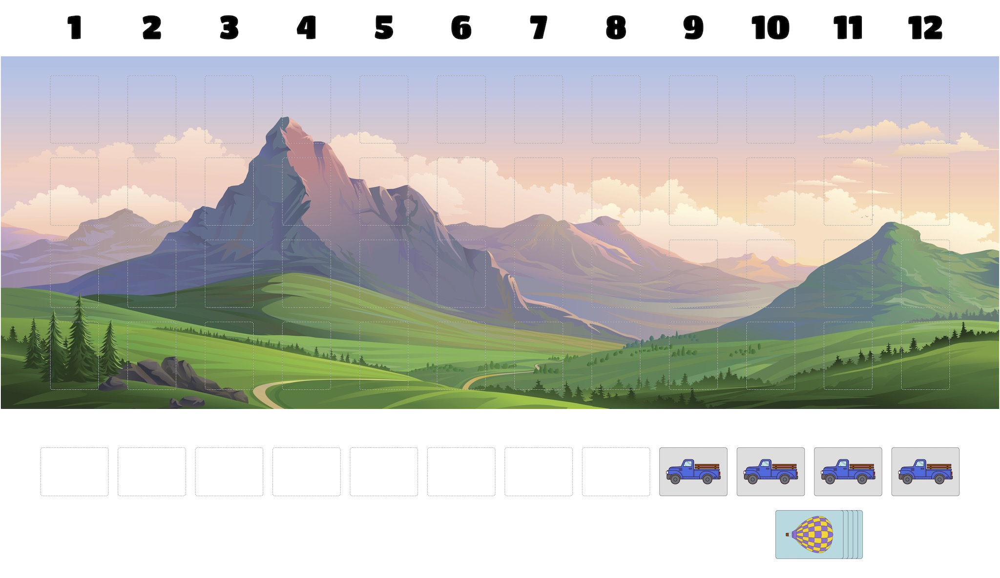
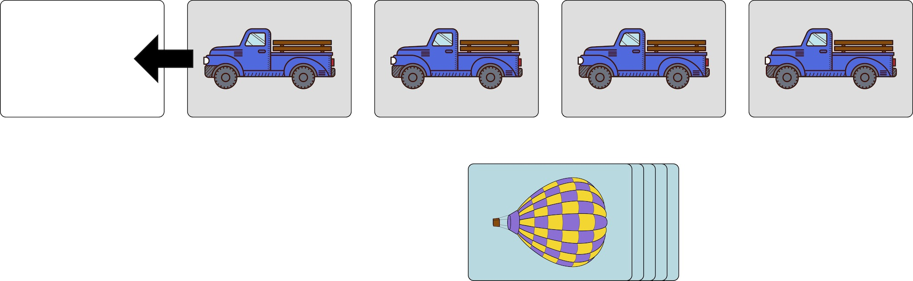
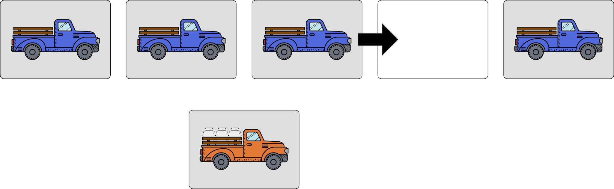
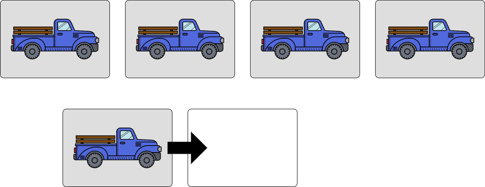
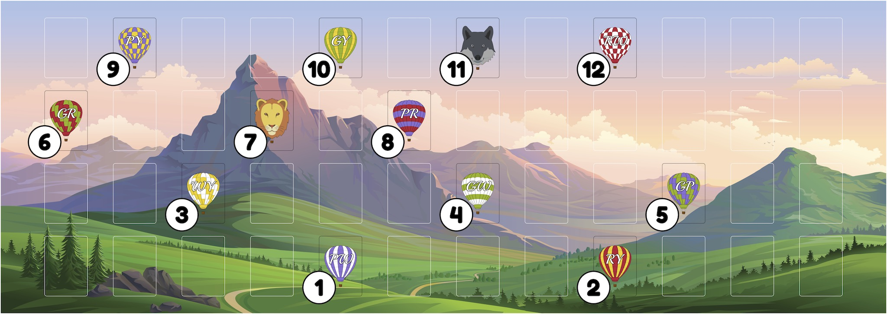

# Aloft
A lightweight strategy game about hot-air ballooning. During the game you will oversee a mass ascension at a balloon festival and try to ensure that your balloons end up in the best positions in the resulting formation.

## Overview
Aloft is a game for one to five players. It can be played in approximately thirty minutes and is intended for players who are at least eight years old.

During the game, you will launch a flight of hot-air balloons. You can play either cooperatively or competitively. In a cooperative game, you will work together to launch all of the balloons in as tight a formation as possible. In a competitive game, each player will be affiliated with a different colour and you will try to ensure that the balloons of your colour are both higher and closer to the front of the formation than the balloons of your opponents' colours.

## Components
  - 13 balloon cards
     - 10 regular balloon cards
     - 3 special shape balloon cards
  - 13 scoring tokens
  - 5 truck cards
  - 5 colour cards
  - 1 game board

<!-- The number of special shape cards, truck cards, and scoring tokens that you will use in your game depends on how many people are playing. See the table below for details. Notice that you will always use all of the regular balloon cards and colour cards but, unless you are playing a five-player game, you will not use all of the special shape cards, truck cards, or scoring tokens. If you are playing with less than five players, you should use the scoring tokens numbered 1-12.

| Player Count | 1 - 4 | 5 |
| ----------: | ---: | ---: |
| Regular Balloon Cards | 10 | 10 |
| Special Shape Cards | 2 | 3 |
| Truck Cards | 5 | 6 |
| Colour Cards | 5 | 5 |
| Scoring Tokens | 12 | 13 |  -->

## Set Up
  1. Deal one colour card at random to each player. Your colour card will determine the colour of balloons with which you are _affiliated_. Do not reveal this card to the other players until the end of the game.
     - Each regular balloon card is affiliated with two of the five possible colours.  The colours that a balloon card is affiliated with are the colours of the envelope of the balloon depicted on that card. Special shape cards are not affiliated with any colour. 
  2.  Collect the truck cards that you will use during your game. Set one truck card aside. Place the remaining truck cards in a single row below the left-hand side of the game board. These truck cards comprise the _launch zone_. The leftmost truck card is called the _last truck_. The rightmost truck card in the launch zone is called the _lead truck_.
  3. Collect the truck card that you set aside in the previous step. Place it below the last truck. This truck card is the _safety truck_.
  4.  Collect the regular balloon cards and special shape cards that you will use during your game. These cards will comprise the _balloon deck_.
  5. Deal the cards in the balloon deck in a single row below the launch zone. 
  6. Place the scoring tokens below the play area.

## Gameplay
On your turn, you will perform either one or two actions:
  1. If at least one balloon is flying, move a truck.
  2. Advance a balloon.

The game ends immediately when the lead truck has moved past the rightmost column of the tableau. If this occurs on your turn, you do not advance a balloon on that turn because the game ends before you get a chance to do so.

### Advance a Balloon
Throughout the game, each balloon will progress through a series of states: packed, unpacked, inflated, and flying at various altitudes. On your turn, you can advance any one balloon of your choice. If you cannot advance any of the balloons, then you should skip this step.

To advance a balloon, you move a balloon from its current state to the next. 
  - All balloons begin in the packed state. All balloons in the packed state should be in the balloon deck.
  - To advance a balloon from the packed state to the unpacked state, you should remove it from the balloon deck and place it horizontally on one of the truck cards in the launch zone. You may not place a balloon on the safety vehicle.
- To advance a balloon from the unpacked state to the inflated state, you should turn it so that it is placed vertically on its truck card.
- To advance a balloon from the inflated state to the flying state, you should slide it into the bottom row of the play area directly above its truck card. It will then be flying at an altitude of one.
   - Balloons that are flying (at any altitude) may never be orthogonally adjacent to another balloon which is flying.
- To advance a ballon that is flying, you should slide it up one row so that its altitude increases by one.
   - The maximum altitude at which balloons can fly is four.
   - Balloons never descend (decrease their altitude) or move horizontally. 

### Move a Truck
If any balloons are flying, then before you advance a balloon you will move a truck. Trucks always move from left to right. The game ends immediately when the lead truck moves past the rightmost column of the tableau.

When you move a truck, you will do one of the following:
  - If the truck cards are in adjacent columns and the safety vehicle is below the last truck (e.g. the starting position) then you should move the rightmost truck one column to the right.

  

  - If the truck cards are not in adjacent columns, then the truck cards will be in two groups which are separated by one empty column. You should slide the rightmost truck from the first group one column to the right. It should then be the leftmost truck in the second group.

  

  - If all of the truck cards are in adjacent rows, but the safety vehicle is not below the last truck (e.g. after each of the truck cards in the launch zone has been moved one time), then you should slide the safety vehicle one position to the right so that it is below the last truck.

  

__Note:__ Any balloon cards that are in the launch zone (i.e. balloons that are in the unpacked or inflated states) should accompany the truck card on which they have been placed when that truck card is moved. 

## Scoring
Each balloon scores a number of points that is determined by its position within the formation. In general, balloons that are flying at higher altitudes score more points than those that are flying at lower alititudes.  If balloons are flying at the same altitude, then the balloons that are closer to the front (right-hand side) of the formation score more points than the balloons that are closer to the back (left-hand side) of the formation. 

Use the scoring tokens to indicate the number of points scored by each balloon. Place the scoring token numbered "1" on the leftmost balloon in the bottom row of the formation. Scanning from left to right, place scoring tokens on the remaining balloons in the bottom row of the formation, always placing the token with lowest remaining number. Then proceed to the next highest row of the formation. Continue in this fashion, scanning from left to right and bottom to top, until each balloon that is flying has been assigned a scoring token.

Notice that the leftmost balloon in the bottom row of the formation always scores one point while the rightmost balloon in the top row of the formation scores one point for every balloon that is flying at the end of the game. See the figure below for a more complete example.

Your score is the sum of the scores for all of the balloons with which you are affiliated (i.e. that match your colour card). You should reveal your colour card when you announce your score so that everyone can verify that the required computations have been performed correctly. The player with the highest score wins the game.

## Solo Mode
Aloft can also be enjoyed as a solo experience. This version of the game is similar to the multi-player version described above, differing in the following ways:
  - You will not use the colour cards or the scoring tokens.
  - You will only use two of the special shape balloon cards.
  - You will shuffle the balloon deck before dealing out the balloon cards in a single row below the tableau. The order in which these cards are arranged is significant. If you choose to unpack a balloon on a given turn, you must unpack the first (leftmost) balloon of the balloon deck.
  - You will adhere to one additional rule that governs the arrangement of balloons in the tableau. At no point can two balloons which share a colour be diagonally adjacent to one another.
  - You will use a different function to compute your score. Your score is equal to the number of adjacent columns required to contain the formation of all balloons which are flying at the end of the game plus a three point penalty for every balloon which you were unable to launch.